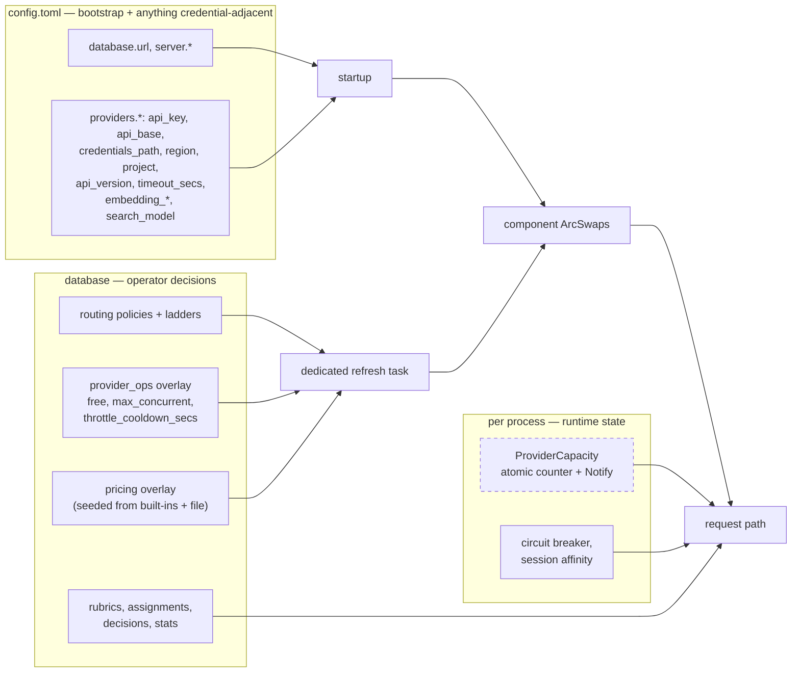

# Routing Design Open Questions - Plan

## Goal Capsule

- **Objective** — an operator can deploy intelligent routing without discovering, in production, that a capacity cap is silently wrong, that an experiment is denying real users, or that a provider credential landed somewhere it should not.
- **Means** — resolve the six unsettled questions in the routing design's §13 against what the codebase actually does, and record each as a decision with its rejected alternatives (KTD1–KTD11).
- **Authority hierarchy** — the routing design spec is authoritative for settled decisions; this plan resolves only what §13 lists as open. Where research contradicts the spec, research wins and the spec is corrected (U7).
- **Stop conditions** — stop and ask when a decision changes what an operator is billed for, or grants a principal access it does not have today. Both appear below and are marked; the Definition of Done requires the sign-off to have happened, not merely to have been requested.

---

## Product Contract

### Summary

Six questions were left open when the routing design reached revision 11. Two block implementation; four block the feature they belong to. This plan resolves each against evidence from the codebase, records the decision and its alternatives in the spec, and corrects five spec claims that research proved wrong.

### Problem Frame

The routing design is settled on its large decisions and cannot be built from as it stands. `ProviderCapacity` — the component that decides whether a free local model has room — counts in-flight requests per process, so a second replica makes the cap wrong rather than merely weaker. Provider credentials and the operational knobs beside them are being pulled toward a database whose backup story is a plain file on a host volume. Shadow traffic spends real money with no owner, and sends user prompts to a provider the caller never chose. A rubric editor is promised to people who have no way to log in.

Each of these is answerable from what the repo already does. None was answered, because the design was written before the code was read.

### Requirements

**Decisions**

- R1. Each of the six open questions in the spec's §13 carries a recorded decision, its rejected alternatives, and a one-line reason. Decisions made in support of those six (KTD7–KTD11) are recorded on the same terms.
- R2. A decision that changes billing attribution or grants a principal new access is marked as needing operator sign-off, and that sign-off is obtained before the implementing phase ships.
- R3. Each decision names the files its implementation touches **and the operator-facing surface it changes** — README section, Helm values comment, or config example — so the follow-on phase can be scoped without re-researching and cannot ship a silent behaviour change.

**Correctness of the record**

- R4. Spec claims that research disproved are corrected, not layered over.
- R5. Decisions that depend on an existing repo mechanism cite that mechanism, so a reader can check the reasoning without repeating the research.
- R6. Defects found during research are recorded as tracked work with a named target, and any defect a decision depends on is marked as a release gate for that decision's phase.

**Implementation readiness**

- R7. Every decision leaves the spec's §10 test list able to state what proves it.
- R8. The spec's revision history records what changed and why, continuing the existing convention.
- R9. A decision that cannot be fully resolved is recorded as an explicit deferral with its reason and a starting point, rather than marked resolved with the choice passed to the implementer.

### Success Criteria

- The spec's §13 "Still open" list is empty, or contains only items explicitly deferred with a reason.
- An implementer starting the routing Phase 1 does not have to make any of these calls themselves.
- The defects found during research exist as tracked work, with the two that gate a phase marked as gates.

### Scope Boundaries

**In scope**
- Deciding and recording the questions above.
- Correcting spec text that research invalidated.

**Not in scope**
- Implementing routing Phase 1. This plan produces decisions; the code follows separately.
- Reopening any decision the spec already records as settled.

### Deferred to Follow-Up Work

Defects surfaced during research. None is caused by this work; two gate a phase of it.

- **The Helm env-var prefix is wrong chart-wide, and the JWT secret is empty as a result.** `src/config/mod.rs` builds its environment source with prefix `MODELROUTER` and separator `__`, so a name must be `MODELROUTER_<SECTION>__<FIELD>`. `deploy/helm/modelrouter/templates/deployment.yaml` uses a doubled prefix separator on four entries — the provider-key loop, `MODELROUTER__AUTH__JWT_SECRET`, and `MODELROUTER__DATABASE__PATH` twice, including the migrate initContainer. Each strips to a top-level key `Settings` has no field for, and serde discards it silently. Consequences: Kubernetes provider secrets never reach `ProviderConfig::api_key`, and because the chart's ConfigMap ships `jwt_secret = ""` on the assumption the env var overrides it, **every Helm deployment signs sessions with an empty secret**. `config.example.toml` documents the broken form on four comment lines. `docker-compose.yml` already uses the correct single-underscore form, so the fix follows an in-repo pattern. **Release gate for U2's follow-on and for U4's portal** — both depend on it.
- **`/v1/mcp/servers` writes are unscoped.** `src/api/routes/mcp.rs` POST/PATCH/DELETE bind `_user: AuthenticatedUser` and discard the identity, so any valid API key can create, edit, or delete any MCP server.
- **`/admin/reports` 500s on Postgres after any health probe.** `src/api/routes/health.rs:322` writes `attribution_tags: "[]"` where every other writer uses `"{}"`; Postgres `jsonb_object_keys` raises on an array and the handler maps it to a 500 for the whole page. SQLite tolerates it, so this only appears in the `--features postgres` build.
- **OIDC-provisioned admins can never be superadmin.** `default_oidc_role()` in `src/config/schema.rs` returns `"admin"`, which is neither validated role, so `SuperDashboardSession` rejects them permanently.

Tracking target: GitHub Issues on this repo, one issue per defect, each linking this plan.

### Sources

- `docs/superpowers/specs/2026-09-02-intelligent-model-routing-design.md` — revision 11, the authority for settled decisions.
- `docs/criticalreviews/2026-09-02-intelligent-model-routing-design-critical-review-{1,2,3}.md` — rounds 1–3.

---

## Planning Contract

### Key Technical Decisions

KTD1. **Shared capacity state is deferred; capacity caps and multi-replica are made mutually exclusive.** Build the per-process counter now behind a trait seam and record shared capacity as a follow-on. The premise is that single-replica is the shipped default, **not that multi-replica is unreachable**: `deploy/helm/modelrouter/templates/hpa.yaml` ships with the chart and `values.yaml` carries `autoscaling.maxReplicas: 3`, so multi-replica is one flag away, and README documents the Redis cache backend as shared across stateless replicas. This decision therefore withdraws an advertised posture — capacity caps or autoscaling, not both — until the follow-on lands. Chosen over building Redis-backed leases immediately, which costs a shared-counter abstraction, a `script` feature addition to the pinned `redis` dependency, and a releaser task, before anyone has asked to scale.

KTD2. **Capacity uses an atomic counter with `Notify`, not a semaphore.** `tokio::sync::Semaphore` gives the time bound free but has no waiter-count API, so a depth bound cannot be expressed; and shrinking a live cap requires acquiring and forgetting surplus permits, which fights the requirement that the cap be read live per check. An atomic in-flight count compared against the live snapshot, plus `Notify` for release wakeups and a separate depth counter, satisfies both and is the shape a shared implementation degrades to. Admission must be a single compare-and-swap against the live cap, not a read-then-increment — the latter admits over the cap under concurrency. Chosen over `Semaphore`, which would make KTD1's follow-on materially harder to retrofit.

KTD3. **Provider configuration splits on a stated rule, with the operational knobs in their own overlay section.** The rule: **any field that determines where a credentialed request is sent, or how it authenticates, stays in the config file and is never writable through the overlay.** By that rule the file keeps `api_key`, `credentials_path`, `region`, `project`, `api_version`, and `api_base`; `api_base` sits on the credential side despite §13.14 grouping it with the knobs, because it selects the endpoint the credential is transmitted to and a GUI-editable value would exfiltrate both the credential and every prompt routed through it. `embedding_region`, `embedding_task_type`, and `search_model` also stay in the file — they select endpoints and models for credentialed calls. The overlay takes `free`, `max_concurrent`, and `throttle_cooldown_secs` only. **`timeout_secs` stays in the file** even though it is operational: `ProviderRegistry` snapshots provider config at startup and each adapter bakes the timeout into a cached HTTP client, so an overlay value would be stored and never take effect — a silent wrong outcome worse than the deploy cadence it was meant to fix. The section is separate from `providers` rather than an overlay of it because overlay merge is whole-section JSON replacement where serde defaults fill gaps; overlaying `providers` would let a capacity edit blank every credential. `free` must move regardless of the rest — leaving it in the file while the ladder is in the DB reintroduces the cross-store consistency problem the pricing gate exists to eliminate. Chosen over keeping the whole block in the file (blocks the transactional pricing gate) and over moving credentials to the DB (needs a crypto dependency and root-key story the product has never had, or an env-reference resolver that is itself blocked on the Helm defect).

KTD4. **Shadow spend is owned by a reserved user and labelled with a `spend_kind` column.** `src/api/routes/health.rs:275-329` already does exactly this for probe spend, with the comment that probes "must appear in the ledger like any other call, attributed to a stable system user so their spend is visible and separable." The column is separately load-bearing: the cache "requests" denominator is `COUNT(*)` over the whole ledger in five query builders, so unlabelled router rows silently depress the reported cache hit rate. Values are `user`, `shadow`, `classifier`, `judge`, and `probe`; the migration backfills existing `health-probe` rows to `probe` rather than relying on the column default, because unlike migration 022's `cache_hit = 0` the default is not true of every existing row. Chosen over charging the triggering user (they did not ask for the experiment, and per-user budget sums cannot exclude it), over making `cost_ledger.user_id` nullable (a SQLite table rebuild, a breaking archive-format change, and eleven `JOIN users` sites that would silently drop the rows, making the headline spend figure under-report real money), and over the `project` column alone (already used this way by the health-probe precedent, but it is caller-settable via the `x-project` header and therefore spoofable, so it cannot be the exclusion predicate).

KTD5. **The key-owner rubric editor gets its own session, exchanged from the API key.** A `/portal` prefix: the owner posts their key, the server runs the same hash-lookup-validate sequence `AuthenticatedUser` already performs, and issues a distinct cookie read by a distinct extractor, rendering server-side templates from its own environment. No migration and no new credential. Chosen over a password login for `users` (the table has no credential column of any kind since migration 012, so this invents a second identity system for a population already holding a strong bearer credential) and over a limited `admin_users` role (`SuperDashboardSession` gates on `role != "superadmin"` and nothing else, so any new role is silently full-viewer — with read access to every user's prompt *and response* bodies, the global key inventory, and a write gated only by `DashboardSession`; making it safe is a repo-wide authorization refactor riding on a rubric feature). *(session-settled: user-directed — chosen over admin-only editing and a propose/approve queue: the team using a key knows its workload better than the platform admin.)*

KTD6. **The objective stays out of the cache key; the probe filters before it reads.** Probing every ladder member already lets a `latency` request find an entry a `cost` request stored, so adding the objective would fragment the cache to buy nothing. Two probe corrections travel with this: ladder members must be filtered through the caller's allow/deny rules *before* probing, because the cache key deliberately omits caller identity and an unfiltered probe would both serve an entry under a key derived from a forbidden model and reveal, through timing, that another caller has asked something; and members must be de-duplicated, because the key is provider-blind so the same model on two providers collapses to one key.

KTD7. **The DB-config decision needs a propagation path it does not have, on its own task.** The `app_settings` overlay is read from the DB once at startup into a dedicated `ArcSwap` and thereafter updated only in the process that served the admin form. `live_settings` is a different thing again — initialized from the file and re-stored wholesale every 30 seconds by the config-reload loop, which would clobber anything written into it from the DB and also drops env-provided values. The routing overlay therefore follows the alias/failover pattern (`RequestRouter::update_db_aliases`, `FallbackChain::update_db_chains`) — push into a component-owned `ArcSwap` — refreshed by **its own unconditional background task**, not by the existing config-file loop: that loop is spawned only when `--config` or `MODELROUTER_CONFIG` names a path, so a bare `modelrouter serve` never starts it, and the hole is invisible in container testing because compose and Helm both set the variable. *(session-settled: user-directed — chosen over the config file as source of truth: ladders change on an operational cadence, and the repo had already answered this with the overlay.)*

KTD8. **"Unpriced" is defined against a seeded overlay, seeded from both existing price sources.** `CostCalculator::new()` hardcodes roughly thirty models and `new_with_config` merges `config.toml`'s `[[pricing]]` entries over them, so a gate checking only the overlay rejects models the operator has already priced, while a gate consulting the calculator cannot run inside the ladder-write transaction. Seed both the built-in table and any file entries into the pricing overlay on first run — including on upgrade of an existing installation, not only on fresh install — and treat the file entries thereafter as a bootstrap input rather than a live source the gate consults. *(session-settled: user-directed — chosen over estimating a price for unpriced models: a feature whose purpose is spending less cannot rank candidates by a price it is guessing at.)*

KTD9. **The portal token is separated from admin sessions cryptographically, and bound to its key's lifetime.** Cookie-name separation is not separation: `DashboardSession` and `AdminSession` validate only an HS256 signature and expiry against the one shared `auth.jwt_secret`, with no role or token-type check, and `AdminSession` also accepts the token from an `Authorization` header. An implementer reusing the repo's existing JWT helpers — the obvious path — would mint a portal token that deserializes as admin claims and is accepted on `/admin/api/prompts`, `/admin/api/users`, and `/admin/api/audit`. So: sign portal tokens with a key derived from `auth.jwt_secret` under a fixed domain-separation label, so they fail signature verification in both admin extractors without editing either, and require a token-type claim the portal extractor checks. Bind the session to its originating key — carry the `api_key_id`, re-run the same validity and enabled checks `AuthenticatedUser` performs on every request, and cap the cookie expiry at the key's own expiry — so revoking a leaked key ends the portal access it granted. Set `Secure` on the portal cookie specifically, notwithstanding the repo's existing plain-HTTP allowance, because this is the first place a bearer credential is submitted through a browser form.

KTD10. **Shadow traffic gets its own spend ceiling and is excluded from the global budget sum.** Gating mirroring on the global budget is not sufficient: shadow rows sit inside `sum_global_since`, so an experiment consumes the headroom that pushes the next *real* request over the limit and into a 429. Give shadow a dedicated ceiling checked before mirroring fires, and exclude `spend_kind`-labelled router rows from the global sum, so experiment spend is bounded on its own budget and can never deny user traffic. The check must be atomic against concurrent launches; a read-then-fire gate admits a burst past the ceiling.

KTD11. **Shadow mirroring requires an explicit data-sharing opt-in.** A mirrored request sends the caller's prompt to a provider the caller never chose, and the ladder member being trialled may be a different vendor entirely. That is a disclosure decision, not a routing one. Record it as operator-facing: shadow is off by default, enabling it per policy states which provider receives mirrored content, and the `X-No-Log` discipline that governs prompt storage applies to mirroring too.

### High-Level Technical Design

Where each piece of configuration and runtime state lives after these decisions. The left column is what an operator edits; the right is what a request reads.

The dashed border on `ProviderCapacity` marks KTD1's deliberate limitation: it is the one piece of request-path state whose correctness depends on there being exactly one process.

### Assumptions

- The deployment that first runs capped local models is single-replica. This is the chart's shipped default, not a structural guarantee — `autoscaling.enabled` is one flag away.
- Postgres remains compile-checked rather than executed: `serve` only ever constructs `SqliteDb`, `AppState.pool` is SQLite-typed, and `migrations/postgres/` has no runner. Migration pairs are still hand-authored twice.

### Sequencing

U1 and U5 are decided together — the capacity primitive and the queue bound are the same object. U2 and U4 both depend on the Helm defect being filed as a release gate. U7 lands last so it can absorb corrections the other units surface.

---

## Implementation Units

### U1. Resolve shared capacity state (spec §13.17)

**Goal:** decide and record whether replica-shared capacity is built now, and what protects an operator who deploys more than one replica anyway.

**Requirements:** R1, R3, R5, R9. Implements KTD1, and KTD2's admission rule jointly with U5.

**Dependencies:** none.

**Files:** `docs/superpowers/specs/2026-09-02-intelligent-model-routing-design.md` (§4a, §13.17, §14). Operator-facing surface: `deploy/helm/modelrouter/values.yaml` comment on `autoscaling`, and the README deployment section.

**Approach:**
1. Record KTD1 with the accurate premise — single-replica is the shipped default, not an unreachable configuration — and record the withdrawn posture explicitly: capacity caps and autoscaling are mutually exclusive until the follow-on lands.
2. Record the guard and **the input it reads**, because the process cannot observe its own replica count: no such field exists in `src/config/schema.rs` and the deployment template injects none. The guard reads a new operator-declared setting defaulting to 1, wired in the chart from the replica count and from the autoscaler's maximum when autoscaling is enabled, using the single-underscore env form `docker-compose.yml` already uses correctly.
3. Record what the guard does **not** cover: it is start-time and operator-declared, so an autoscaler that boots at one replica and scales to three under load defeats it, and a capacity cap raised through the overlay after startup is not re-checked. Record the overlay-write re-check as part of the guard, and the scale-out case as a stated limitation of the deferral.
4. Record the seam: a trait boundary at the counter so the shared implementation is a second impl, not a rewrite.
5. Record what the follow-on needs, so it is not re-researched: lease-scored entries rather than bare increment/decrement (a killed replica must not leak its slot forever), a `script` feature addition to the pinned `redis` dependency for atomic multi-command operations, and a channel-fed releaser task because `Drop` is synchronous and a shared release is a network round trip.
6. Correct §4a's claim that counters are released by RAII: true for the per-process counter, not achievable as written for a shared one.

**Test expectation:** none — decision-and-record unit, no code changes. The spec's §10 gains: a capacity cap plus a declared replica count above one refuses to start; the same check fires on an overlay write that raises a cap; the per-process counter releases on every early-return path.

**Verification:** §13.17 no longer appears under "Still open"; §4a carries the limitation, the guard's input, and the corrected release discipline.

---

### U2. Resolve the provider config and secrets boundary (spec §13.14)

**Goal:** decide and record which provider fields live in the file and which move to the database.

**Requirements:** R1, R2, R3, R5, R6. Implements KTD3.

**Dependencies:** none. **Release gate:** the Helm env-prefix defect must be filed and fixed before this decision's follow-on phase ships.

**Files:** `docs/superpowers/specs/2026-09-02-intelligent-model-routing-design.md` (§5 config, §7.0, §13.14, §14). Operator-facing surface: `config.example.toml` provider blocks and their comments.

**Approach:**
1. Record KTD3's **rule** first, then the field lists it produces — the rule is what a later reader needs when a new field appears. Assign every field `ProviderConfig` has today; none may be left unstated.
2. Record why `api_base` lands on the credential side against §13.14's own grouping, and why `timeout_secs` stays in the file despite being operational.
3. Record the separate-section requirement and its reason — whole-section replacement plus serde defaults would let a capacity edit blank every credential — and note that the same hazard applies *within* `provider_ops`, so a partial write must not reset sibling knobs.
4. Record who may write the overlay: `provider_ops` writes are capacity and cost controls, so they take `SuperDashboardSession` like model and alias writes, not `DashboardSession` like budgets and reports.
5. Record the migration for values already in operators' files: seed existing file values for the moved fields into the overlay on first run, following KTD8's seeding pattern, and log a deprecation warning on the file keys thereafter rather than ignoring them silently.
6. Record the deployment evidence: compose mounts config read-only and the database on a writable host volume, so credentials in the database are a regression against a `:ro` mount; the chart's values file already states the intent that secrets arrive as environment variables.
7. Record the env-reference variant as the deliberate follow-on rather than a rejected option, and name its prerequisite.
8. Correct the spec's example config: `api_key = "${ANTHROPIC_API_KEY}"` does not work. `MODELROUTER_<SECTION>__<FIELD>` env override does work and is tested; `${VAR}` interpolation inside TOML values does not exist.

**Execution note:** state the compose volume asymmetry explicitly rather than leaving it as reasoning — this is the decision most likely to be revisited by someone who has not read the deployment evidence.

**Test expectation:** none — decision-and-record unit. The spec's §10 gains: an overlay write to `provider_ops` cannot alter any credential or endpoint field; a partial overlay write leaves sibling knobs unchanged; file values for moved fields are seeded on first run.

**Verification:** §13.14 resolved with every `ProviderConfig` field assigned; the spec's config example no longer shows unsupported interpolation.

---

### U3. Resolve shadow spend attribution (spec §13.10)

**Goal:** decide and record whose budget absorbs shadow spend, how it is excluded from savings and cache statistics, and what disclosure mirroring requires.

**Requirements:** R1, R2, R3, R5. Implements KTD4, KTD10, KTD11.

**Dependencies:** none.

**Files:** `docs/superpowers/specs/2026-09-02-intelligent-model-routing-design.md` (§7.0a, §9, §13.10, §14). Operator-facing surface: README highlights entry for shadow traffic, and the policy config example.

**Approach:**
1. Record the reserved-user decision, citing the health-probe precedent as prior art for the same question, and the rejected alternatives including the caller-spoofable `project` column.
2. Record the `spend_kind` column with all five values and the **backfill** of existing probe rows — the column default is not true of rows that already exist, unlike migration 022's precedent.
3. Record KTD10: a dedicated shadow ceiling checked atomically before mirroring fires, and exclusion of router-owned rows from the global sum. State the failure it prevents — shadow consuming the headroom that denies the next real request — and that shadow requests spawned after the response never pass through the policy check at all.
4. Record KTD11: mirroring sends caller prompts to a provider the caller never chose, so it is off by default, names its recipient when enabled, and honours the same no-log discipline as prompt storage.
5. Record the reserved row's inability to authenticate as an **invariant to enforce**, not an observed property: both key-creation paths find-or-create a user by name, so reserved system names must be rejected there or an admin can attach a live credential to the shadow identity.
6. Record the two rough edges rather than hiding them: the reserved user appears in the admin user list, and the disable control on it appears to work and does nothing — a false kill switch. The real control is the per-policy shadow setting.

**Operator sign-off required:** this decision changes what appears in a customer's ledger and sends prompt content to an additional provider. Obtain sign-off before the shadow phase ships; the Definition of Done requires it to have happened.

**Test expectation:** none — decision-and-record unit. The spec's §10 gains: router rows are excluded from the cache-hit denominator and the global budget sum; mirroring stops at its own ceiling under concurrent launches; creating an API key for the reserved user fails; existing probe rows read as `probe` after migration.

**Verification:** §13.10 resolved; §7.0a states the ceiling, the exclusion, and the disclosure.

---

### U4. Resolve the key-owner authorization surface (spec §13.11)

**Goal:** decide and record how a key owner authenticates to edit their rubric, what the view exposes, and how the session is separated from admin sessions.

**Requirements:** R1, R2, R3, R5, R6. Implements KTD5, KTD9.

**Dependencies:** none. **Release gate:** the Helm env-prefix defect must be fixed before the portal ships — it nullifies the JWT secret the portal's session depends on.

**Files:** `docs/superpowers/specs/2026-09-02-intelligent-model-routing-design.md` (§6b, §13.11, §14). Operator-facing surface: README section for the portal, and any ingress guidance.

**Approach:**
1. Record KTD5 and why the limited-role alternative is dangerous rather than merely imperfect.
2. Record KTD9 as the mechanism behind the separation claim: domain-separated signing key, token-type claim, key binding with per-request revalidation, expiry capped at the key's, and `Secure` on the portal cookie. The spec currently asserts the outcome as a test with no mechanism that produces it.
3. Record the exposure boundary, and answer §13.11's spend sub-question explicitly rather than leaving "stats scoped to it" to interpretation: state whether cost figures render at all, and whether the stats shown are scoped to the single key or to the policy pooled across other tenants' keys. Per-key scoping exists at the repository layer for cost queries but not in the reports handlers, and the `prompts` table has no key column — so prompt content cannot be scoped to a key and the view must not touch it.
4. Record the portal's permanent boundary: the key's own rubric and its own stats. Any further key-holder-facing page is a separate product decision, not an extension of this one.
5. Record that `/portal` mounts on the same listener as the inference API, so an ingress rule written for `/admin` does not cover it.
6. Record that audit works unchanged: the audit actor id is already optional, so a key-owner edit records with a null actor id and a key-scoped actor name.
7. Record the honest cost: a login page, a session cookie, an extractor, and a template namespace.

**Operator sign-off required:** this grants a principal that has never had web access a session. Obtain sign-off before the delegation phase ships.

**Test expectation:** none — decision-and-record unit. The spec's §10 gains: an unauthenticated portal request redirects; a portal token is rejected by both admin extractors; a portal session stops working on the next request after its key is disabled; a rubric write is clamped by the tier ceiling.

**Verification:** §13.11 resolved with the spend sub-question answered; §6b names the surface, its exposure boundary, and the separation mechanism.

---

### U5. Resolve queue bounds and the capacity primitive (spec §13.12)

**Goal:** decide and record how the cost-path queue is bounded and what primitive backs it.

**Requirements:** R1, R3, R5, R9. Implements KTD2.

**Dependencies:** U1 — the same object.

**Files:** `docs/superpowers/specs/2026-09-02-intelligent-model-routing-design.md` (§4d, §13.12, §14).

**Approach:**
1. Record KTD2's primitive decision with its two disqualifying facts about `Semaphore`, and the compare-and-swap admission rule that prevents exceeding a live cap under concurrency.
2. Record the queue as per member rather than per provider, and the reason — tokio's semaphore is strict FIFO, so "wake the cheapest waiter first" is not expressible across members without a hand-rolled queue.
3. Record both bounds and the shed behaviour when either is hit: fall through to the next tier, which is the behaviour queueing was an exception to.
4. Record the wakeup ordering hazard as a design note: the notified future must be created before the final counter re-check, or wakeups are lost.
5. Record the **default queue depth as an explicit deferral** under §13.12 with its reason and a stated starting point, rather than marking the question fully resolved while the number is chosen under time pressure. The default is user-visible — it decides whether a request waits or sheds.

**Test expectation:** none — decision-and-record unit. The spec's §10 gains: concurrent admissions never exceed the live cap; a queued request that exceeds either bound spills; depth is decremented on the timeout path and on cancellation.

**Verification:** §4d names both bounds and the primitive; §13.12 records the depth default as a deferral rather than as resolved.

---

### U6. Resolve the objective and cache-key interaction (spec §13.13)

**Goal:** decide and record whether the request objective enters the cache key, and correct the probe's specification.

**Requirements:** R1, R3, R5, R7. Implements KTD6.

**Dependencies:** none.

**Files:** `docs/superpowers/specs/2026-09-02-intelligent-model-routing-design.md` (§4 Probe, §9, §13.13, §14).

**Approach:**
1. Record the decision to leave the objective out of the key, with the reason that multi-member probing already achieves the cross-objective hit.
2. Record the allow/deny ordering constraint and both harms it prevents: serving an entry keyed on a forbidden model, and leaking through probe timing that another caller asked something.
3. Record member de-duplication before the probe, because the key is provider-blind.
4. Record that the probe needs its own hit/miss counters. A fifteen-key probe currently books one hit and fourteen misses against models nobody requested, corrupting the statistic that feeds the health endpoint and the admin cache page.
5. Record the batched-read requirement — the cache trait exposes only single-key reads today, so this is a new method on both backends — and the reachability gate, including that the health check is itself a live round trip and so needs a stated freshness window rather than a per-request call.

**Test expectation:** none — decision-and-record unit. The spec's §10 gains: a probe records one accounting event, not one per member; a probe never reads a key for a model the caller is denied; an unreachable store skips the probe without a per-request round trip.

**Verification:** §13.13 resolved; §4 *Probe* carries the filter-then-dedupe-then-batch ordering and the freshness window.

---

### U7. Record the supporting decisions, correct the invalidated claims, and publish revision 12

**Goal:** record KTD7 and KTD8, bring the spec's factual claims in line with the codebase, and publish the revision.

**Requirements:** R1, R4, R6, R8. Implements KTD7, KTD8.

**Dependencies:** U1–U6.

**Files:** `docs/superpowers/specs/2026-09-02-intelligent-model-routing-design.md` (§2a, §5, §7.0, §14); `docs/criticalreviews/` (round-4 record). Operator-facing surface: none directly; the corrections feed the surfaces named in U1–U4.

**Approach:**
1. Record KTD7 in §5 with its rejected alternative and reason, including the dedicated refresh task and why the existing config-file loop cannot carry it.
2. Record KTD8 in §7.0 with its rejected alternative and reason, including seeding from both price sources and on upgrade as well as fresh install.
3. Correct the five claims research disproved: env-var interpolation (§5 config example), RAII release for shared counters (§4a), the overlay's actual capabilities and target (§5), the probe's cost and accounting (§4), and "unpriced" having a second source of truth (§7.0).
4. Add the verified facts to §2a with their citations, so the next reviewer can check rather than re-derive.
5. Write the revision 12 entry naming what changed and why, following the existing revision-history convention.
6. File the deferred defects as GitHub issues, one per defect, marking the Helm entry as a release gate for U2's and U4's phases.

**Execution note:** correct superseded text in place. The spec has eleven revisions of history already; layering a correction over a wrong claim leaves both readable and the implementer picks one.

**Test expectation:** none — documentation unit.

**Verification:** no claim in §2a or §5 contradicts the cited code; every KTD in this plan appears in the spec; §13 "Still open" is empty or carries only explicit deferrals.

---

## Verification Contract

| Gate | How |
|---|---|
| Spec internal consistency | §13 "Still open" empty or explicitly deferred; no §2a claim contradicts its citation |
| Decision completeness | Each of KTD1–KTD11 appears in the spec with its rejected alternative and reason |
| Follow-on scoping | Each decision names the files its implementation touches and the operator-facing surface it changes |
| Sign-off | The two decisions marked as requiring operator sign-off have it, recorded in the spec |
| Defect capture | Each deferred defect has a GitHub issue; the Helm entry is marked as a release gate on U2 and U4 |
| No code regression | `cargo verify-project` passes; no source file is modified by this plan |

This plan changes documentation only. The repository's test suite is unaffected, and running it proves nothing about this work — the verification is that the decisions are recorded, grounded, and checkable.

## Definition of Done

- All six §13 questions carry a recorded decision with rejected alternatives and a reason, or an explicit deferral with a starting point.
- KTD7 through KTD11 are recorded on the same terms.
- The two decisions requiring operator sign-off have been signed off, not merely marked.
- Each decision with an operator-visible consequence names the surface its implementation must update.
- The five invalidated claims are corrected in place.
- Revision 12 is recorded in the spec's revision history.
- Each deferred defect has a tracked issue, and the Helm defect is marked as gating U2's and U4's phases.
- No abandoned or experimental text remains in the spec from this pass.

## Open Questions

These need an operator's answer during execution. Neither blocks starting.

- **Shadow ledger visibility (U3).** A reserved user row appears in the admin user list and in per-user reports. Acceptable, or should it be filtered from operator-facing lists the way the write-only webhook secret pattern hides credentials?
- **Delegation timing (U4).** The portal is a small feature's worth of work and adds the product's first non-admin web surface. Ship it with routing Phase 1, or ship routing with admin-only rubric editing and add delegation after?
