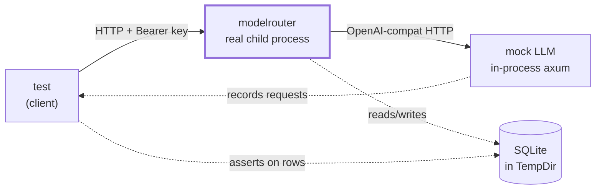

# End-to-End Test Harness - Plan

## Goal Capsule

- **Objective** — a change that stops modelrouter from serving requests fails a test, instead of reaching an operator.
- **Means** — an integration tier that runs the real binary as a child process against a mock LLM provider over real sockets, and drives it as a client would.
- **Authority hierarchy** — the running binary is the authority. Where a test and the code disagree about behaviour, the test is rewritten to describe what the binary does, or the binary is fixed; the test is never made to pass by reaching inside the process.
- **Stop conditions** — stop and ask if making a test pass would require changing production behaviour beyond an evidenced defect.

---

## Product Contract

### Summary

Add an end-to-end tier that starts `modelrouter serve` as a real process, points it at a mock LLM provider, and exercises it over HTTP. Existing tests build `AppState` by hand and call `build_router` in-process, so nothing covers `main`, config loading, migrations, startup guards, or the binary's own wiring.

### Problem Frame

On 2026-09-03 a startup guard was added that refuses to serve when `auth.jwt_secret` is empty or is the shipped placeholder. `modelrouter init` writes that placeholder and then prints "Run: modelrouter serve". A fresh install could not start.

All 425 tests passed. They passed because every one of them constructs `AppState` directly and never executes the startup path — so a guard that refuses to boot is structurally invisible to the entire suite. The defect reached `main` and was found by running the binary by hand.

That class of defect — anything in `main`, `serve`, config resolution, migration execution, or process wiring — has no test that could fail.

### Requirements

**Harness**

- R1. A fixture starts the real compiled binary as a child process and stops it on drop, including on panic.
- R2. The fixture uses a temporary config and database. It never reads or writes `~/.modelrouter`, and never binds a fixed port.
- R3. Readiness is determined by polling `/health` until it answers, never by sleeping.
- R4. A mock LLM provider serves the OpenAI shape on an ephemeral port, records the requests it received, and can be programmed to return errors, delays, and specific token counts.

**Coverage**

- R5. The startup path is covered: a config with a real secret serves; a config with the placeholder secret refuses, with a message naming the field.
- R6. Migrations run against a real file-backed database, and running them twice is safe.
- R7. A request authenticated with a valid key reaches the provider and returns its response; an invalid key is rejected.
- R8. Token usage reported by the provider becomes a cost-ledger row with the expected model and provider.
- R9. An identical eligible request served twice reaches the provider once.
- R10. A provider error is surfaced as a router error rather than a panic or a hang.

**Evidence**

- R11. The suite's output is captured in a document that states what each test proves and shows the run.
- R12. The tier is excluded from the default `cargo test` run so it does not slow ordinary development, and is runnable by a single documented command.

### Success Criteria

- Reverting the `init` secret-generation fix makes a test fail.
- `cargo test` runtime is unchanged for developers who do not opt in.
- Every test asserts on observable behaviour — HTTP responses, database rows, or requests the mock received.

### Scope Boundaries

**In scope** — the harness, the mock provider, and the coverage in R5–R10.

**Not in scope** — routing Phase 1 (not built), streaming assertions beyond a smoke check, Postgres (never executed by any code today), load or performance testing, and CI wiring.

### Deferred to Follow-Up Work

- Wire the tier into CI once it has proven stable locally.
- Extend the mock to cover the Anthropic shape so `/v1/messages` can be exercised.
- Streaming assertions: that SSE arrives incrementally and the ledger row is written after the stream ends.

---

## Planning Contract

### Key Technical Decisions

KTD1. **Run the real binary, not an in-process router.** `env!("CARGO_BIN_EXE_modelrouter")` gives integration tests the compiled binary's path with no extra dependency. Chosen over `axum_test::TestServer`, which is what the existing 425 tests use and is exactly the thing that cannot catch a startup defect.

KTD2. **The mock provider is an in-process axum server on an ephemeral port.** It binds `127.0.0.1:0`, reports its port, and shares recorded state with the test through an `Arc<Mutex<Vec<RecordedRequest>>>`. Chosen over a second child process (nothing to inspect afterwards) and over a static fixture server (no per-test programmability).

KTD3. **Provider name `mock`, served by the OpenAI-compat adapter.** `ProviderRegistry` falls through to `OpenAICompatAdapter` for any name it does not recognise, so no production code changes to support the mock. This is load-bearing: the harness tests the real adapter path.

KTD4. **Ephemeral ports everywhere, discovered by binding `:0`.** A fixed port makes the suite fail when run twice concurrently or when anything else holds the port. The router's port is chosen the same way and written into its config.

KTD5. **`#[ignore]` rather than a cargo feature.** `cargo test` stays fast by default; `cargo test -- --ignored` runs the tier. Chosen over a feature flag because a feature would need adding to every CI invocation to be useful, and over a separate crate because the harness needs no isolation the test target does not already give it.

### High-Level Technical Design

The two dotted inspection paths are what make assertions possible: the test can ask the mock what modelrouter *sent*, and query the database for what modelrouter *recorded* — neither of which is visible from the HTTP response alone.

### Assumptions

- `serve` runs migrations itself (`src/cli/mod.rs:255`), so the fixture does not need a separate `migrate` step — though R6 tests that path explicitly.
- The binary under test is the debug build cargo produces for the test target; no release build is required.

---

## Implementation Units

### U1. Mock LLM provider

**Goal:** an HTTP server that behaves enough like an OpenAI-compatible provider to exercise the real adapter, and records what it received.

**Requirements:** R4.

**Files:** `tests/common/mock_llm.rs` (new); `tests/common/mod.rs` (declare).

**Approach:**
1. `MockLlm::start() -> MockLlm` binds `127.0.0.1:0`, spawns an axum server, exposes `base_url()`.
2. Routes: `POST /v1/chat/completions`, `GET /v1/models`.
3. Programmable behaviour behind a shared handle: a response queue and a default. Each entry is a status plus a body, so a test can queue a 429 then a 200 and assert the retry.
4. Record every request — path, headers of interest, and parsed body — into shared state; expose `requests()` and `request_count()`.
5. Response body carries configurable `usage.prompt_tokens` / `completion_tokens` so cost assertions have known inputs.

**Test scenarios:** exercised by every unit below; it has no independent behaviour worth asserting except that `request_count()` is zero before use.

**Verification:** a test can start it, POST to it directly, and see the request recorded.

---

### U2. Router process fixture

**Goal:** start and stop the real binary reliably, with isolated state.

**Requirements:** R1, R2, R3.

**Files:** `tests/common/e2e.rs` (new); `tests/common/mod.rs` (declare).

**Approach:**
1. `RouterProcess::start(mock_base_url) -> RouterProcess`: create a `TempDir`, write a config with a generated secret, the mock as `[providers.mock]`, `routing.default_provider = "mock"`, and a port from a `:0` bind released immediately before use.
2. Spawn `env!("CARGO_BIN_EXE_modelrouter") serve` with `MODELROUTER_CONFIG` pointed at the temp config, capturing stdout and stderr to files in the temp dir.
3. Poll `GET /health` with a short interval until it answers or a deadline passes; on timeout, fail with the captured log so the failure is diagnosable.
4. Helpers: `base_url()`, `create_user_and_key()` shelling to the real `user create` / `key create` subcommands, `db_path()`, `logs()`.
5. `impl Drop`: kill the child and wait for it. The `TempDir` cleans itself.

**Execution note:** write the readiness poll and the Drop before any test uses the fixture — a fixture that leaks processes or races on startup poisons every test built on it.

**Test scenarios:**
- Fixture starts and `/health` returns 200.
- Two fixtures started concurrently do not collide on port or database.
- Dropping the fixture leaves no live child process.

**Verification:** a test using only the fixture passes repeatedly and leaves no `modelrouter` process behind.

---

### U3. Startup and migration coverage

**Goal:** cover the path that had no test — the one that let the init regression ship.

**Requirements:** R5, R6.

**Files:** `tests/test_e2e_startup.rs` (new).

**Approach:**
1. `init_then_serve_starts`: run the real `init` against a temp home, then `serve`, and assert `/health` answers. This is the regression test for the placeholder-secret defect.
2. `placeholder_secret_refuses_to_start`: write a config carrying the shipped placeholder, run `serve`, assert it exits non-zero and its stderr names `auth.jwt_secret`.
3. `empty_secret_refuses_to_start`: same with an empty value.
4. `migrations_apply_to_a_fresh_database`: run `migrate` against a temp path, assert the file exists and carries the expected tables.
5. `migrations_are_idempotent`: run `migrate` twice, assert the second run succeeds.

**Test scenarios:** the five above are themselves the scenarios; each names its input, action, and expected outcome.

**Verification:** reverting the `init` fix makes `init_then_serve_starts` fail.

---

### U4. Request path coverage

**Goal:** prove a client request reaches the provider and comes back, with auth enforced.

**Requirements:** R7, R10.

**Files:** `tests/test_e2e_requests.rs` (new).

**Approach:**
1. `valid_key_reaches_provider`: create a user and key, POST a completion, assert 200, assert the mock recorded exactly one request, and assert the upstream request carried the model the client asked for.
2. `missing_key_is_rejected` and `invalid_key_is_rejected`: assert 401 and that the mock recorded nothing — the rejection must happen before any upstream call.
3. `provider_error_surfaces`: queue a 500 on the mock, assert the router returns an error status rather than hanging or panicking, and that the process is still alive afterwards.
4. `unknown_model_is_handled`: assert the documented behaviour rather than an invented one — capture what the binary actually does and encode that.

**Test scenarios:** as enumerated; each asserts both the client-visible response and the mock's record.

**Verification:** all four pass against the running binary.

---

### U5. Accounting and cache coverage

**Goal:** prove the side effects an operator relies on actually happen.

**Requirements:** R8, R9.

**Files:** `tests/test_e2e_accounting.rs` (new).

**Approach:**
1. `usage_becomes_a_ledger_row`: mock returns known token counts; after the request, open the temp SQLite directly and assert one `cost_ledger` row with the expected model, provider, and token counts.
2. `identical_request_is_served_from_cache`: enable the cache in the fixture's config, send the same eligible request twice, assert the mock saw exactly one request and the second response carries the cache header.
3. `streaming_smoke`: request with `stream: true`, assert the response is an event stream and the process survives. Deeper streaming assertions are deferred.

**Execution note:** query the database directly with sqlx rather than through an admin endpoint — the point is to prove the row exists, not that a page renders.

**Test scenarios:** as enumerated.

**Verification:** all pass; the cache test fails if the cache is disabled, proving it asserts the real behaviour.

---

### U6. Evidence document

**Goal:** a reader can see what is covered and that it ran.

**Requirements:** R11, R12.

**Files:** `docs/testing/e2e-harness.md` (new).

**Approach:**
1. What the tier is for, and the specific gap it closes, with the init regression as the worked example.
2. How to run it, and why it is `#[ignore]` by default.
3. A table: each test, what it proves, and which requirement it covers.
4. The captured output of a real run.
5. The negative control: revert the init fix, show the test failing, restore it. This is what distinguishes a test that asserts something from a test that passes.
6. Known gaps, stated plainly — Postgres, `/v1/messages`, deep streaming.

**Test expectation:** none — documentation unit.

**Verification:** the document's run output matches a run reproduced from its own instructions.

---

## Verification Contract

| Gate | How |
|---|---|
| Default suite unaffected | `cargo test` passes and its runtime is unchanged |
| E2E tier passes | `cargo test -- --ignored` green |
| Harness leaves no residue | No `modelrouter` process and no temp dir after a run |
| Negative control | Reverting the init fix fails `init_then_serve_starts` |
| No production change | The diff touches `tests/` and `docs/` only |

## Definition of Done

- The tier runs green and is excluded from the default suite.
- Every test asserts on an HTTP response, a database row, or a request the mock recorded.
- The negative control is demonstrated, not asserted.
- The evidence document carries a real run.
- No production source file is modified by this work.
