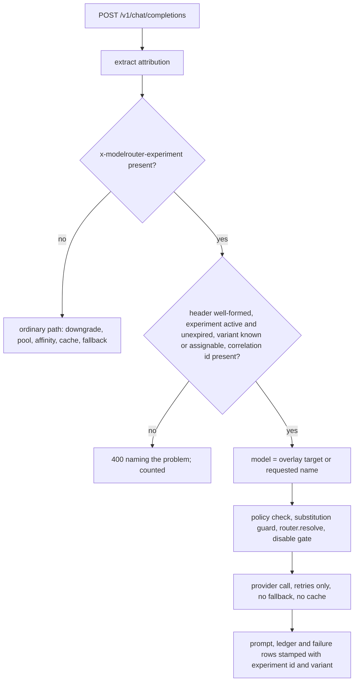
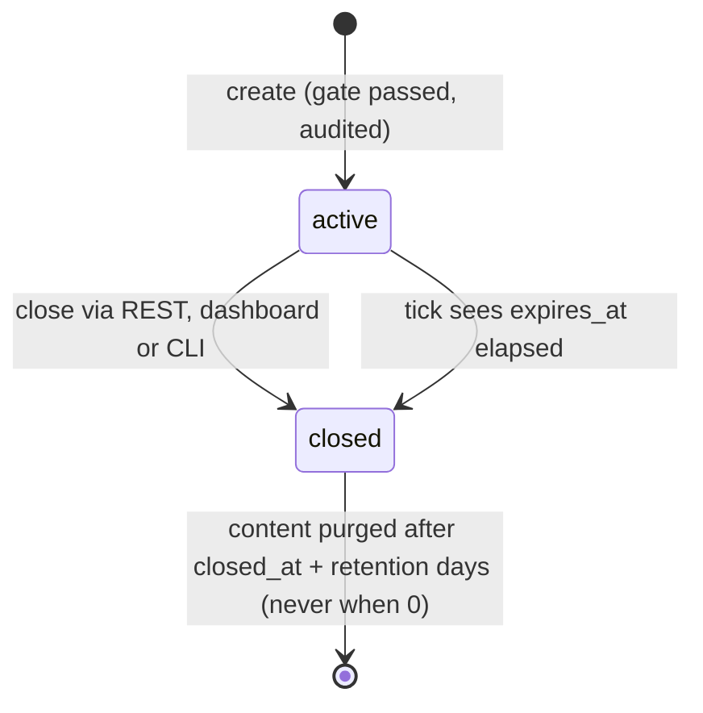
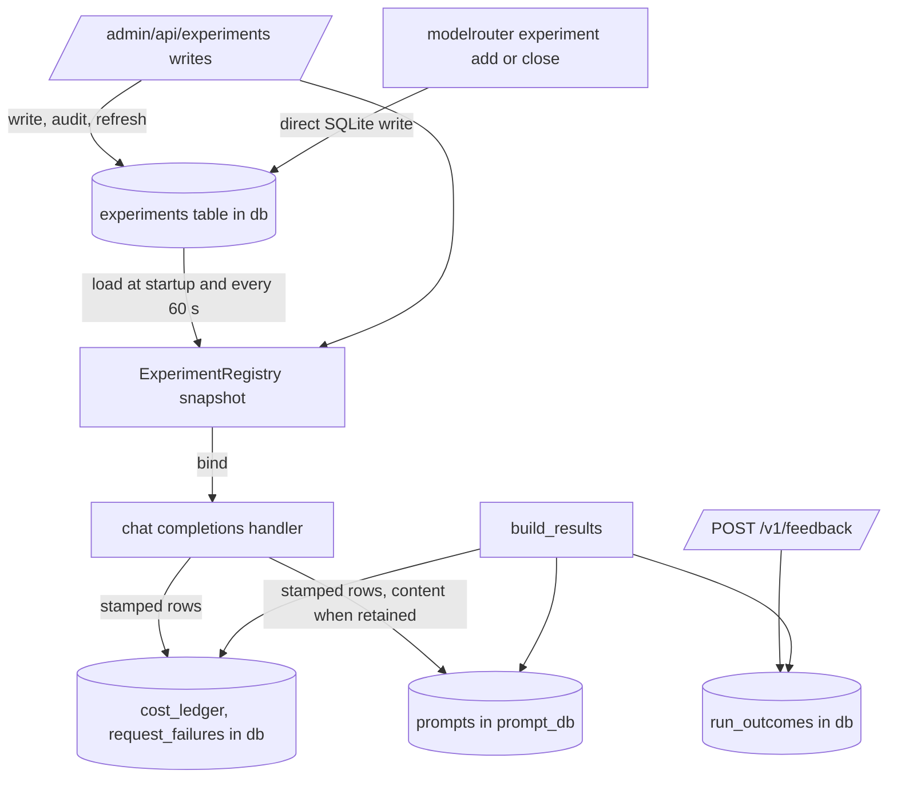

# Controlled experiments - variants, outcome feedback and results - Plan

## Goal Capsule

- **Objective:** a client application can create an experiment with named variants, send `/v1/chat/completions` traffic bound to a variant through `x-modelrouter-experiment`, report each run's outcome through `POST /v1/feedback`, and read per-variant and per-run results back (JSON, CLI, dashboard page, and the Variant dimension on `/admin/compare`) — with expiry, auto-close, the pricing gate at creation, and scoped content retention; all documented end to end.
- **Authority:** the spec at `docs/superpowers/specs/2026-09-02-intelligent-model-routing-design.md` (revision 16): §7a controlled experiments, §7b comparison analysis, §7c content retention, §4e validity boundaries, §11 phasing (feedback precedes run-level experiments). Settled decisions there are not reopened; what the spec leaves to implementation is decided under Key Technical Decisions and Assumptions.
- **Execution profile:** one feature branch off `main`, one PR, ordinary repo verification (`cargo test`, `cargo build --features postgres,otel`, `cargo clippy --all-targets`), one new migration pair (SQLite and Postgres), the privacy grep from `CLAUDE.md` before every commit.
- **Stop conditions:** paired mirroring (§7.0a) and the Pair dimension, policy-id overlays, the Phase 1 `Router` trait, classifier, tiered pools, learning from experiment traffic, and `request_params` recording are out of scope; a unit that appears to need one of them stops and leaves the item in Scope Boundaries.
- **Tail ownership:** implementation, review and PR continue in this session; merge is the user's call.

---

## Product Contract

### Summary

The compare page shipped first (§13.20) and lets an operator compare two arms an application labelled itself. The router still cannot bind a request to a variant, cannot see whether a run succeeded, and cannot report a run's turn count or wall-clock span. This plan adds the mechanism: an `experiments` table whose variants are alias overlays, a request header that pins a request to a variant (or lets the router assign one by session hash), a feedback endpoint that records the outcome the router cannot observe, a results document that groups requests into runs by the existing attribution correlation id, and the surfaces — JSON, CLI, dashboard, compare page — through which a client application and its operators read the results. Content retention for experiment traffic is a scoped, superadmin-gated, time-bounded exception to the metadata-only default.

### Problem Frame

A downstream caller runs one engagement twice on different model sets and wants to know which set finished cheaper, faster, in fewer turns — and whether it finished at all. Today it can tag both runs and compare cost and latency, but the router picks models by alias, session affinity and pools with no way to force a run onto one set; the caller must reconfigure aliases between runs, which is neither concurrent nor auditable. Nothing records success, so every comparison reports that the cheaper model won (§13.18). And a quality judgment needs the answers, which the shipped default keeps off disk. The experiment mechanism has to fail closed on caller directives (§4e), stay bounded on the hot path, treat the header as untrusted input, and never widen retention or egress beyond the traffic it names.

### Requirements

**Experiment definition and lifecycle**

- R1. An `experiments` row carries `id`, `name`, `variants` (JSON: label to overlay, each target stored with the provider and model it resolved to at creation), `allowed_user_ids` (JSON list of user ids; empty means every key), `status` (`active` or `closed`), `feed_learning`, `expires_at`, `created_at`, `closed_at`, `retain_content`, and `content_retention_days`; `expires_at` and `content_retention_days` are required at creation with no default at any layer (serde, clap, HTML, SQL), and `0` means never.
- R2. A variant is an overlay: a map from a requested model name to a target model expression; a variant may map nothing (the router's ordinary routing is the control arm).
- R3. Creation is rejected when any overlay target does not resolve without substitution to one configured provider and model, names a load-balancer pool, or resolves to a model with no price in the cost table; the resolved provider and model of each target are pinned with the variant at creation and are what a bound request routes to, so an alias edit after creation does not move an active experiment. Creation is also rejected when `retain_content` is set with `expires_at = 0`: a retaining experiment must have a finite expiry. Every id in `allowed_user_ids` must name an existing user.
- R4. An experiment past `expires_at` stops binding requests from the first request after the boundary and is marked closed with `closed_at` by a background tick; manual close (REST, dashboard, CLI) sets the same fields idempotently; closing starts the content-retention clock.
- R5. Creation and close are superadmin writes and are audited with the chosen expiry and retention values, including the word never when chosen.

**Request binding**

- R6. `x-modelrouter-experiment: <id>[:<variant>]` on `POST /v1/chat/completions` binds the request when the caller's user is on the experiment's allowed list (an empty list admits every key): the explicit variant's overlay, or, with the id alone, the variant chosen by a stable hash of the request's `session_id`; a bound request bypasses complexity downgrade, pool selection, session affinity, the response cache and the fallback chain.
- R7. A malformed header, an unknown, closed or expired experiment, an unknown variant, a caller not on the experiment's allowed list, an id-only header without a string `session_id`, or a bound request with no attribution correlation id is rejected with 400 naming the problem, never silently routed; each rejection is counted.
- R8. The header on any other `/v1/*` endpoint — including `/v1/messages`, `/v1/responses`, `/v1/embeddings`, `/v1/audio/*`, `/v1/images/*`, `/v1/mcp/*`, `/v1/search`, `/v1/models` and the new `/v1/feedback` — is rejected with 400 saying where experiments are supported.
- R9. Binding costs no database round-trip and no unbounded work: the header is bounded to 128 bytes, the registry is an in-memory snapshot, and the overlay is one map lookup before ordinary alias resolution.
- R10. Every prompt, cost-ledger and request-failure row written for a bound request carries the experiment id and variant label.
- R11. The rows recorded for a request name the model and provider that actually answered it, including after a fallback hop; a streaming request's ledger row carries the provider-reported token usage when the stream carries it, is marked `tokens_estimated` when the figures are character-count estimates, and is written when the stream ends for any reason (client abort or provider error included), not only on `[DONE]`. Both are pre-existing defects that experiments would otherwise inherit.

**Outcome feedback**

- R12. `POST /v1/feedback` under the caller's API key records one outcome per correlation id per user: `outcome` is `success` or `failure`, with optional `score` (0 to 1), `rating` (integer 1 to 5) and `note` (bounded, metadata only, never prompt or response content); a later report replaces the earlier one. The outcome is stamped with the experiment id and variant of the run's earliest stamped ledger row, when there is one.
- R13. Feedback for a correlation id that has no recorded request (ledger or failure row) under the caller's user is a 400 whose message says the run is not recorded and may be retried; feedback is accepted for closed experiments and for runs outside any experiment.

**Results**

- R14. `GET /admin/api/experiments/:id/results` returns the experiment's metadata, per-variant aggregates (runs, requests, cost, saved cost, tokens in and out, per-run and per-request figures, latency with its own sample count, failures, rows whose token usage is estimated, unbound requests, unpriced models, per-model breakdown, outcome counts and rates, mean score and rating, retained-content bytes where retention is on), and a paginated list of per-run rows (user id, correlation id, variant, turn count, cost, tokens, started and ended timestamps, span, latency samples, failures, unbound requests, outcome, mixed-variant flag), plus the count of runs seen under more than one variant. Cache hits are not reported: bound requests never use the cache (R6). An unbound request is a ledger row sharing a bound run's user and correlation id with no experiment id — a turn the client sent without the header — and is counted, not merged.
- R15. `GET /admin/api/experiments` lists experiments (default active, `status=all|active|closed`), `GET /admin/api/experiments/:id` returns one, `POST /admin/api/experiments` creates, `POST /admin/api/experiments/:id/close` closes; reads take an admin JWT, writes a superadmin JWT.
- R16. `/admin/compare` gains the Variant dimension: two variants of one experiment, chosen through the existing key slot, with the quality caveat pointing to the experiment's results page.
- R17. `/admin/experiments` on the dashboard lists experiments, creates one through a form whose expiry and retention controls have no preselected value, closes one after an in-page confirmation, shows a per-experiment results panel, and answers a rejected create with an inline message naming the field; an experiment that retains content is badged there and on the compare page, with the window shown (`never` when 0).
- R18. `modelrouter experiment add|list|close|results` provides the same operations on the CLI, with `--format table|csv|json` on `list` and `results`.

**Content retention**

- R19. For a bound request whose experiment has `retain_content`, the prompt row is written with full messages and response regardless of `[storage] store_prompts` and `store_prompt_content`, on the non-streaming and streaming paths alike; `X-No-Log` still wins; traffic outside the experiment and the callback egress are unchanged — the prompt-row write gets its own flag and callback dispatch stays behind the existing `skip_log`, so retention never turns callbacks on.
- R20. The hourly retention purge leaves rows of a retaining experiment alone while the experiment is open or its window has not elapsed, and once `closed_at` plus `content_retention_days` has passed redacts their content (messages and response, the shape `redact_prompt_content` writes) and clears the feedback notes of the experiment's runs, keeping the metadata the results page reads; a window of never is never redacted. The experiment half of the purge runs on every hourly tick regardless of the global `prompt_retention_days`, and a tick that cannot read the experiment list skips the global sweep rather than run it with an empty exception list.
- R21. The results document and dashboard show retained-content bytes beside spend, and the compare page says whether the variant arms have stored content.

**Documentation**

- R22. `docs/experiments.md` describes both mechanisms end to end — tag-labelled arms as shipped, and header-bound variants with feedback and results — with request and response examples a client application can copy; `README.md`, the `CLAUDE.md` endpoint and CLI tables, and `CHANGELOG.md` are updated.

### Key Decisions

- **A variant is an overlay over alias resolution, and an unmapped model routes normally.** Governs R2, R6. The spec settles that a variant is a set of bindings, not a model. Whether a request for a name the overlay does not mention is routed normally or rejected is left open; routing it normally is chosen so the empty overlay is a first-class control arm and an application need not enumerate every alias it touches. The per-variant per-model breakdown in results (R14) is what keeps a mixed run visible rather than silent. Rejected: 400 on unmapped names, which would make the control arm inexpressible without a wildcard and kill a run mid-flight on the first alias nobody listed.
- **Bound requests do not fall back and do not use the response cache.** Governs R6, R11. The experiment is the routing decision (§7a); a fallback hop or a cache hit would record cost and latency that belong to another model or to no provider call at all, and the ledger today already records a fallback under the model that failed (R11). Rejected: leaving both on and reporting cache hits, which biases toward whichever arm has the warmer cache.
- **Any key may bind unless the experiment names its callers.** Governs R1, R3, R6, R7. Experiment ids are small integers and the results feed model decisions, so without a scope any co-tenant could stamp its traffic into any experiment, skew its aggregates, or have its content retained under an experiment it was never named in. `allowed_user_ids` (empty = every key) is part of the snapshot and checked at bind time; a mismatch is a 400 like the other rejections. Rejected: an owner column (an operator runs an experiment on behalf of a caller, the caller does not own it) and a global per-key enable flag (§11's later per-application gate can layer on top of the list).
- **Overlay targets are pinned at creation.** Governs R3. The registry stores the provider and model each target resolved to when the experiment was created and binds to that pair; an alias edit afterwards changes ordinary traffic, not an active experiment. Rejected: re-resolving the target expression per request, which lets an alias edit move an immutable variant with no audit trail and shows up only after the fact in the per-model breakdown.
- **A run is keyed by user and correlation id.** Governs R12 to R14. Correlation ids are caller-chosen strings, so two keys can carry the same one; grouping ledger rows by `(user_id, attribution_correlation_id)` matches how outcomes are already keyed and stops one key's rows or outcome attaching to another key's run. Rejected: correlation id alone, which lets a co-tenant join and score another user's run.
- **Session id stays the assignment key.** Governs R6. Hashing the correlation id would make an id-only run single-variant by construction, but the spec settles `session_id`; a run that spans several sessions under an id-only header appears in the mixed-run count rather than silently, and a caller that wants one variant per run sends the explicit `id:variant` form. An id-only header with no `session_id` is a 400 (R7).
- **A bound request needs a correlation id.** Governs R7. A run is the set of requests sharing one; a bound request with none can never receive an outcome, which is exactly the trap §7a exists to close. Rejected: counting such requests under the variant with no run, which quietly reintroduces price-only comparison.
- **Outcomes are keyed by correlation id, not decision id.** Governs R12, R13. The spec's `decision_id` form belongs to the Phase 1 decision log, which does not exist; §7a says the run-level outcome is keyed by correlation id. The endpoint name and shape leave room for the decision-id form later.
- **The rejection on feedback for an unrecorded run says so and invites a retry.** Governs R13. Ledger rows are written after the response returns, so a client that reports immediately after its last turn can race the insert. Silent acceptance is forbidden by the spec; a 400 that names the race lets the client retry.
- **Experiment traffic is measured with normal storage rules unless retention is on.** Governs R19, R20. Per-run cost, tokens, turns and span come from `cost_ledger`, which after U1 is written for every request including a stream that ends early; latency and content come from `prompts` only where storage allows, and every figure that depends on prompt rows carries its own sample count.
- **Streaming rows carry real usage or say they are estimates.** Governs R11, R14. Today the streaming logger counts characters divided by four, records no cache tokens, and writes nothing unless `[DONE]` arrives; an experiment comparing a caching-friendly arm against a cheaper tokenizer would see fiction. The provider stream's usage is carried into the ledger where the stream includes it (the Anthropic translation gains it; OpenAI-compatible streams carry it when the caller asks for `stream_options.include_usage`), estimated rows are flagged, and results count the flagged rows per variant the way they count unpriced models. Rejected: injecting `stream_options` into upstream requests (changes what every caller's provider sees) and leaving the estimate silent.
- **A retaining experiment must expire, and the window redacts rather than deletes.** Governs R3, R20. An open retaining experiment with no expiry would store full content without bound; requiring a finite `expires_at` bounds the intake window, and the audited `content_retention_days` (at most 3650, or never) bounds how long it stays. At the end of the window the content columns are redacted in place — the same shape a non-retaining row has — so latency samples and per-request metadata survive as they do for every other experiment. Rejected: deleting the rows (a closed retaining experiment would then have thinner results than a non-retaining one) and a per-experiment byte quota (a second limit with no clear reject behaviour mid-run).
- **Feedback notes are metadata with the outcome's lifecycle; retained content is protected by the existing prompt-log boundary.** Governs R12, R20. `note` is bounded to 1024 characters, documented as not for content, cleared with the experiment's content window, and otherwise kept like attribution tags. Retained content lives in the prompt database and is readable only through the existing admin-session prompt-log surfaces; logs never print prompt content today and the new code prints none. Rejected: dropping `note` (the spec lists it) and at-rest encryption (a deployment property of the database file, out of scope for this feature and documented as such).
- **CLI writes are audited.** Governs R5. The CLI writes to the database directly like `alias` and `webhook`, but R5 makes the audit row the record of who chose a retention window, so `experiment add` and `close` write `experiment.create` and `experiment.close` entries with actor `cli` through the helper `src/cli/admin.rs` already uses. Rejected: leaving the CLI unaudited to match `alias`, which stores nothing sensitive.
- **Learning is not built.** Governs R1. `feed_learning` is stored and returned so the contract is complete for the Phase 2 learning work; nothing reads it yet.

### Scope Boundaries

- Paired mirroring (§7.0a), the Pair dimension, judge sampling, `model_quality_stats`, explore/exploit, and the decision log with `x-modelrouter-decision`.
- Policy-id overlays, the `Router` trait, classifier, tiered pools, `X-Routing-Objective`.
- `request_params` recording (§7a follow-on).
- Experiment binding on `/v1/messages` and `/v1/responses` (the header is rejected there, R8).
- Editing an experiment after creation (variants are immutable so the split cannot drift; close and create anew).
- Deleting experiments or their results.
- A `/portal` or per-key self-service surface for experiments.
- At-rest encryption of retained content (a property of the database deployment; documented).
- CSRF tokens on the dashboard forms: the dashboard session cookie is `SameSite=Lax`, the control every existing mutation form relies on, and the new forms use the same handlers and cookie.
- Freezing a closed experiment's results at close (a later price-table or purge change can still move the figures; the results document says when it was computed).

### Deferred to Follow-Up Work

- A wildcard overlay key that sends every unmapped name to one target.
- The `decision_id` form of `POST /v1/feedback`.
- Outcome columns on the compare page for the Variant dimension (the caveat points to the results page for now).
- A Postgres runtime test for the new repository methods, in the existing ignored Postgres suite.

---

## Planning Contract

### Key Technical Decisions

- KTD1. **Binding is resolved once, immediately after attribution extraction, by a registry snapshot.** `AppState.experiments: Arc<ExperimentRegistry>` holds an `ArcSwap` map from experiment id to an immutable snapshot (status, `expires_at`, allowed user ids, sorted variant labels, per-variant overlay of requested name to pinned `provider/model`, `retain_content`). `bind(headers, body, attribution, user_id) -> Result<Option<Binding>, BindError>` parses the header, checks status and expiry against the current time, checks the caller against the allowed list, picks the variant, and returns the overlay; `BindError` is a router-layer enum converted to `ApiError::InvalidRequest` in `src/api/error.rs` the way `Unavailable` is, so the router module does not depend on the API layer. The registry is rebuilt from the database after every in-process admin write and on a 60-second tick that also performs auto-close, so a CLI write, a close on another replica, or a retention change is honoured within a minute; expiry is also checked per request against the clock so the first request after the boundary is rejected before the tick. The hot path never touches the database (R9). Modelled on `router.db_aliases` and `refresh_router_aliases`.
- KTD2. **The overlay is applied as a substitution of the requested model name before ordinary resolution.** The bound handler replaces `model` with the overlay's pinned `provider/model` when the requested name is mapped, then continues through the policy check, `guard_model_substitution` and `router.resolve` exactly as a caller-supplied `provider/model` would. No new resolution path in `RequestRouter`; the policy allow-list therefore sees the effective name. Bound requests skip `maybe_downgrade`, `load_balancer.resolve_available`, the session-affinity block, the cache lookup and store, and `next_available_fallback`. A bound request whose effective name is a pool is a 400 naming the pool and the fix.
- KTD3. **Stable variant assignment is FNV-1a 64 over `"{experiment_id}:{session_id}"` modulo the number of variants, over labels sorted bytewise.** No dependency, deterministic across processes and restarts, and immutable variants keep the split stable.
- KTD4. **Header grammar and bounds.** At most one `x-modelrouter-experiment` header, at most 128 bytes, split on the first `:`; the id must parse as a positive integer; a label must match `[A-Za-z0-9_.-]{1,64}`. Values are echoed in error messages only after they pass the charset check. Rejections are logged with a stable event name and counted through the existing request metrics with status `experiment_rejected` where Prometheus or OTel is enabled, and they land in `request_failures` at stage `request` as any 400 does.
- KTD5. **Schema.** Migration `029_experiments.sql` in `migrations/` and `migrations/postgres/`: `experiments` (id autoincrement, `name` unique, `variants` TEXT JSON — each target is `{"target": "<expression>", "provider": "
", "model": "<m>"}` —, `allowed_user_ids` TEXT JSON NOT NULL DEFAULT `'[]'`, `status` TEXT, `feed_learning` boolean, `expires_at` INTEGER unix seconds NOT NULL no default with 0 meaning never, `created_at` TEXT, `closed_at` TEXT NULL, `retain_content` boolean, `content_retention_days` INTEGER NOT NULL no default); `run_outcomes` (`user_id`, `attribution_correlation_id`, `outcome`, `score` REAL NULL, `rating` INTEGER NULL, `note` TEXT NULL, `experiment_id` INTEGER NULL, `experiment_variant` TEXT NULL, `created_at`, `updated_at`, primary key on user and correlation id, index on `experiment_id`); `experiment_id INTEGER NULL` and `experiment_variant TEXT NULL` on `prompts`, `cost_ledger` and `request_failures`, with indexes on `(experiment_id, created_at)` on all three and `(attribution_correlation_id, created_at)` on `prompts`; `tokens_estimated INTEGER NOT NULL DEFAULT 0` on `cost_ledger` (U1). `expires_at` is an integer because it is compared arithmetically in Rust and in the auto-close statement; every other timestamp stays RFC3339 text.
- KTD6. **Input encoding for expiry and retention.** REST `expires_at` is an RFC3339 string or the number `0`; CLI `--expires-at <RFC3339|never>` is `required = true` with no `default_value`; the dashboard control is a `<select required>` of relative durations plus Never behind an empty placeholder. `content_retention_days` is an integer, bounded to 3650, on all three. Request bodies are parsed from `serde_json::Value` by hand so a missing field is a 400 naming it rather than axum's generic rejection; the struct fields carry no `#[serde(default)]`.
- KTD7. **Runs are grouped in SQL by `(user_id, attribution_correlation_id)` over ledger rows stamped with the experiment.** A run's variant is the variant of its earliest stamped row (SQLite: bare column beside `MIN(created_at)`; Postgres: `DISTINCT ON` or a window function — the two impls differ and the Postgres one is compile-checked only until the ignored suite runs); rows under a different variant set `mixed_variants` and the run is counted once in `mixed_runs`. Attribution is explicit: run-level figures (run count, turns, span, outcome, mixed flag) go to the run's variant; request-level figures (requests, cost, saved, tokens, failures, estimated rows, per-model breakdown) go to each row's own variant, so per-variant request totals always sum to the experiment's totals while run counts may not. Unbound requests are ledger rows with the same user and correlation id and a NULL experiment id, counted per run and per variant. Prompt rows, failure rows and outcomes are joined in Rust by user and correlation id because `prompt_db` may be a separate SQLite file (the two-query shape `compare.rs` already uses); nothing is a cross-database SQL join.
- KTD8. **Retention runs on `prompt_db` with the experiment list read from `db`.** Two new `PromptRepository` methods: `purge_older_than_except(cutoff, &[experiment_id])` used by the hourly global sweep with the ids of every retaining experiment whose window is open, and `redact_experiment_content(experiment_id)` called for each closed retaining experiment whose `closed_at + content_retention_days` has passed (the boundary is computed in Rust from the fetched rows, not in dialect-specific SQL); `OutcomeRepository::clear_notes(experiment_id)` runs beside it. The experiment half runs on every tick; only `purge_older_than_except` sits behind the existing `retention_days > 0` guard. If the experiment-list read fails the tick logs and skips the global sweep. In the handler the prompt-row write is gated by `write_prompt = !x_no_log && (store_prompts || binding.retain_content)`, while the existing `skip_log` keeps gating callback dispatch; both redaction sites — the non-streaming spawn and `log_streaming_request`, which today reads `state.storage` on its own — receive an effective `StorageConfig` (content forced on for a retaining binding) carried through `StreamLogCtx` on the streaming path.
- KTD9. **Results are one repository-backed document assembled in `src/api/admin/experiments.rs` and shared by JSON, dashboard and CLI**, the way `compare::build_comparison` is shared today: a `build_results(&ExperimentSources, id, page)` function over `CostRepository`, `PromptRepository`, `FailureRepository` and `OutcomeRepository`. Per-run rows are paginated (`limit` default 200, max 1000, `offset`), ordered by last activity descending, with total counts.
- KTD10. **Placement.** `/admin/api/experiments` and `/admin/experiments` rather than the spec's `/admin/api/routing/experiments` and Routing page, because no routing module or page exists yet; the CLI is `modelrouter experiment …` for the same reason. The experiments admin module follows `src/api/admin/aliases.rs` (audited writes, snapshot refresh after each write), not `webhooks.rs`.
- KTD11. **Base branch.** The feature branch is cut from `main`; PR #57 (compare review findings) is open and touches `arm_predicate` in the same six backend files U6 edits, so if it merges before U6 lands, `main` is merged into the feature branch first and the Variant branch is added to the one-per-backend `arm_predicate(filter, model_column)` it introduces.

### High-Level Technical Design

Request binding, the one path with several decision points:

Experiment lifecycle:

Registry and persistence, the components and who refreshes whom:

Directional only; the implementer picks names and signatures within the patterns each unit cites.

### Assumptions

These were decided without a user in the loop; each is reversible in one unit.

- Outcome reporting is `POST /v1/feedback` keyed by correlation id under the caller's API key, one outcome per run per user, last write wins (Key Decisions; U7).
- Content retention (§7c) is in scope as its own late unit rather than deferred (U11).
- Placement is `/admin/api/experiments`, `/admin/experiments` and `modelrouter experiment …` (KTD10).
- An unmapped model under a bound request routes normally (Key Decisions; U4).
- Bound requests skip the response cache and the fallback chain (Key Decisions; U4).
- Experiment ids are integers and appear as such in the header; names are unique and human-readable.
- Both `active` and `closed` experiments answer results; only `active` ones bind.
- A run is `(user_id, correlation id)` everywhere — grouping, outcomes, unbound counts — so the same correlation id under two keys is two runs; the docs still say correlation ids should be unique per deployment.
- `allowed_user_ids` is the whole caller scope; per-application enablement (§11) can be layered later.

### Sequencing

Three phases, each leaving `main` shippable: foundation (U1 to U4: attribution fix, schema, registry, request path), surfaces (U5 to U10: admin API and results, feedback, dashboard, compare dimension, CLI), retention and documentation (U11, U12). U5 may start once U2 lands; U7 needs U2; U8, U9 and U10 need U6 (U6 owns `ArmFilter::Variant`, which U9 consumes).

---

## Implementation Units

### U1. Record the model that answered and the usage the provider reported

- **Goal:** cost, prompt and ledger rows name the provider and model that produced the response, not the one first resolved; streaming rows carry provider-reported usage where the stream has it, are flagged when estimated, and exist even when the stream ends early.
- **Requirements:** R11.
- **Dependencies:** U2 for the `tokens_estimated` column (the migration lands first; the two units are one commit sequence).
- **Files:** `src/api/routes/completions.rs` (`log_streaming_request`, `StreamLogCtx`, fallback loop); `src/providers/anthropic.rs` (`translate_anthropic_sse`); `src/db/models.rs` (`NewCostLedgerEntry.tokens_estimated`); `tests/test_completions.rs`, `tests/test_streaming.rs` or the nearest existing streaming test file.
- **Approach:** after the provider loop, price with `current_model` and record `current_model` and `current_provider` in the prompt and ledger rows and the response metadata; leave `model` (the requested name) as the request model; the streaming context takes the same values. In `log_streaming_request`, parse each chunk's `usage` object (`prompt_tokens`, `completion_tokens`, `prompt_tokens_details.cached_tokens`) when present and prefer it over the character estimate; set `tokens_estimated = 1` when no usage arrived. Make the Anthropic translator stateful per stream so `message_start.usage` and `message_delta.usage` are emitted as an OpenAI-shaped `usage` object on the final chunk. Wrap the stream in a guard whose `Drop` spawns the same write with `finish_reason: "aborted"` when the write has not happened, so a client abort or provider error still leaves a ledger row (and a failure row for the error case).
- **Patterns:** the existing `current_model` and `current_provider` loop variables at the metrics call; `extract_text_from_sse` for chunk parsing; the `Drop`-spawned write shape used by the session-affinity sweep for detached async work.
- **Test scenarios:** happy — primary provider fails, fallback answers, the ledger row names the fallback model and provider and the cost matches the fallback model's price; a streamed response whose final chunk carries `usage` records those figures with `tokens_estimated = 0`; edge — no fallback taken, rows unchanged; a stream without `usage` records the estimate with `tokens_estimated = 1`; a mock Anthropic stream's `message_start` and `message_delta` usage arrive in the ledger; error — a stream that errors mid-way still writes a ledger row with the tokens seen and a failure row at stage `provider`; a client that drops the connection leaves a row with `finish_reason: aborted`; integration — the existing fallback and streaming tests still pass.
- **Verification:** `cargo test fallback`, `cargo test stream`.

### U2. Schema and repositories

- **Goal:** the `experiments` and `run_outcomes` tables, the marker columns, and repository traits exist on both backends.
- **Requirements:** R1, R10, R12.
- **Dependencies:** none.
- **Files:** `migrations/029_experiments.sql`, `migrations/postgres/029_experiments.sql`; `src/db/models.rs`; `src/db/repositories/experiments.rs`, `src/db/repositories/outcomes.rs`, `src/db/repositories/mod.rs`; `src/db/sqlite/experiments.rs`, `src/db/sqlite/outcomes.rs`, `src/db/sqlite/mod.rs`; `src/db/postgres/experiments.rs`, `src/db/postgres/outcomes.rs`, `src/db/postgres/mod.rs`; `src/api/app.rs` (both `DatabaseProvider` bound lists); `NewPrompt`, `NewCostLedgerEntry`, `NewRequestFailure` and every literal that builds them (`src/api/routes/*.rs`, `src/api/failure_log.rs`, `src/db/sqlite/*.rs` tests, `src/db/prompt_store.rs` tests, `tests/test_compare.rs` seeds).
- **Approach:** per KTD5. `ExperimentRepository`: `create`, `get`, `list(status filter)`, `close(id, closed_at)` returning whether a row changed, `close_expired(now_epoch)` returning the ids closed, `all_retaining_open_or_within_window(now)`, `closed_retaining(now)` returning closed retaining rows for the Rust-side window check. `OutcomeRepository`: `upsert`, `for_experiment(id)`, `get(user_id, correlation_id)`, `clear_notes(experiment_id)`. `CostRepository` gains `run_stamp(user_id, correlation_id) -> Option<RunStamp{experiment_id, variant}>` (earliest stamped row; `Some(RunStamp{None,None})` when rows exist unstamped) and `FailureRepository` gains `has_rows_for_user(user_id, correlation_id)`. The record structs gain `experiment_id: Option<i64>` and `experiment_variant: Option<String>`, written by every insert; `NewCostLedgerEntry` gains `tokens_estimated: bool`.
- **Patterns:** `migrations/025_model_aliases.sql` pair for dialect differences; `src/db/repositories/aliases.rs` for the trait shape; `src/db/sqlite/costs.rs` inline tests on `:memory:` with `sqlx::migrate!`.
- **Test scenarios:** happy — create then get round-trips every column including `expires_at = 0`, `content_retention_days = 0`, `allowed_user_ids` and the pinned provider and model per target; edge — duplicate name is an error, `close` twice changes one row once, `close_expired` closes only rows with `expires_at > 0` and elapsed; error — inserting without `expires_at` fails at the SQL level; integration — `cargo build --features postgres,otel` compiles the Postgres impls.
- **Verification:** `cargo test experiments`, `cargo build --features postgres,otel`.

### U3. Experiment registry, binding and the lifecycle tick

- **Goal:** an in-memory registry that binds a request to a variant with no database access, refreshed by admin writes and a background tick that auto-closes expired experiments.
- **Requirements:** R4, R6, R7, R9.
- **Dependencies:** U2.
- **Files:** `src/router/experiments.rs` (new), `src/router/mod.rs`; `src/api/app.rs` (`AppState.experiments`); `src/cli/mod.rs` (startup load and the tick beside the retention loop); every `AppState` literal under `tests/`.
- **Approach:** per KTD1, KTD3, KTD4. `ExperimentRegistry::load_from(&db)` builds snapshots; `bind(&headers, &body, &attribution, user_id)` returns `Ok(None)` without the header, `Ok(Some(Binding{experiment_id, variant, overlay, retain_content}))` or a `BindError` whose message names the failure (converted to `ApiError::InvalidRequest` in `src/api/error.rs`); the allowed-list check runs before variant selection; overlay values are the pinned `provider/model` strings; `reject_header(&headers)` for other endpoints. The tick every 60 seconds calls `close_expired(now)` then reloads the whole table; a close audit entry is written for each auto-closed id with actor `system`.
- **Patterns:** `RequestRouter::update_db_aliases` and `refresh_router_aliases`; the session-affinity sweep loop for the tick shape; `attribution.rs` bounds and `is_safe_tag_key` style charset checks.
- **Test scenarios:** happy — explicit variant returns its overlay; id-only with `session_id` returns the same variant on repeated calls and both variants across many session ids; edge — expiry one second in the past is rejected before the tick runs, a `closed` snapshot is rejected, a header of 129 bytes is rejected without echoing it, two header instances are rejected, `session_id` that is a number is rejected; error — unknown id, unknown label, missing correlation id, a user id not on a non-empty allowed list, each with a message naming the field; a user on the list, and any user when the list is empty, binds; integration — after `close_expired` and reload the same header is rejected; a row written directly to the table is bindable after `load_from`.
- **Verification:** `cargo test router::experiments`.

### U4. Request-path integration

- **Goal:** `/v1/chat/completions` honours a binding end to end and every other `/v1` endpoint rejects the header.
- **Requirements:** R6, R7, R8, R10.
- **Dependencies:** U1, U3.
- **Files:** `src/api/routes/completions.rs` (non-streaming, streaming and cache paths, `StreamLogCtx`); `src/api/failure_log.rs`; `src/api/routes/messages.rs`, `responses.rs`, `embeddings.rs`, `audio.rs`, `images.rs`, `mcp.rs`, `search.rs`, `models.rs` (rejection only; U7 adds `feedback.rs`); `tests/test_experiments.rs` (new, built like `tests/test_compare.rs` with `MockLlm`).
- **Approach:** per KTD2. Bind right after attribution extraction with the authenticated user's id; substitute the pinned overlay target; skip downgrade, pool, affinity, cache and fallback when bound; reject an effective pool name; stamp the binding into `NewPrompt`, `NewCostLedgerEntry` and `StreamLogCtx`; split the prompt-row gate from `skip_log` per KTD8 so U11 only has to flip `retain_content` into it; `context_from_request` re-derives the binding from the header through the registry (no database) so failure rows are stamped; the other handlers call `reject_header` first.
- **Patterns:** the `attribution` clone into every record struct; `guard_model_substitution`; `should_skip_affinity` for header helpers.
- **Test scenarios:** happy — a bound request to alias `planner` under a variant mapping it to the mock provider's second model is answered by that model and the ledger and prompt rows carry the experiment id, variant and correlation id; the same request without the header routes to the alias's normal target; an empty-overlay variant routes normally but is stamped; id-only binding with a `session_id` lands on one variant consistently; edge — a bound request with `session_id` does not create or use an affinity pin; a bound request identical to a cached one is not served from cache; a bound request whose provider fails is a 502 with a stamped failure row, no fallback; error — closed experiment, unknown variant, missing correlation id, a key not on the allowed list each 400; the header on `/v1/messages`, `/v1/search` and `/v1/models` is 400; integration — streaming bound request stamps its rows on `[DONE]`; a request under a mapped alias still lands on the pinned model after `update_db_aliases` moves the alias.
- **Verification:** `cargo test --test test_experiments`.

### U5. Admin API: create, list, get, close, with the pricing gate and audit

- **Goal:** experiments are managed through `/admin/api/experiments` with validation, the pricing gate, audit entries and registry refresh.
- **Requirements:** R1, R3, R5, R15.
- **Dependencies:** U2, U3.
- **Files:** `src/api/admin/experiments.rs` (new), `src/api/admin/mod.rs`, `src/api/app.rs` (routes); `tests/test_experiments_admin.rs` (new).
- **Approach:** per KTD6 and KTD10. Validate: name 1 to 128 chars and unique; 2 to 16 variants; labels per KTD4 and distinct; each overlay at most 32 entries with keys and targets at most 128 chars; `expires_at` and `content_retention_days` present; `retain_content` boolean, and `retain_content` with `expires_at = 0` is a 400 naming both; `allowed_user_ids` optional list of integers (default empty) each of which must exist in `users`. Gate every target: `router.resolve_detailed` must not substitute, the provider must be in `provider_registry`, `load_balancer.is_pool` must be false, and `cost_calc.has_price("{provider}/{model}")` must be true; the resolved pair is stored beside the expression (R3); the 400 names the variant, the key and the target. Audit `experiment.create` with the full row (expiry and retention rendered as never when 0) and `experiment.close`; refresh the registry after each write. Reads on `AdminSession`, writes on `SuperAdminSession`.
- **Patterns:** `src/api/admin/aliases.rs` handlers and `audit(...)`; `compare.rs` `validate()` for 400s that name the field.
- **Test scenarios:** happy — create with two variants returns 201 and the row; list defaults to active and `status=all` includes closed; close returns the row with `closed_at`; edge — `expires_at: 0` and `content_retention_days: 0` accepted and audited as never; `retain_content: true` with `expires_at: 0` is 400 naming both; an `allowed_user_ids` entry that is not a user is 400; one variant, seventeen variants, a duplicate label, a target that is a pool, a target that would substitute, an unpriced target each 400 naming the offender; the stored row carries the pinned provider and model per target; error — missing `expires_at` is 400 naming `expires_at`, admin (non-super) JWT on create is 403, no JWT is 401; integration — a request bound to the new experiment succeeds without a restart.
- **Verification:** `cargo test --test test_experiments_admin`.

### U6. Results aggregation and the results endpoint

- **Goal:** one results document per experiment, served as JSON and reusable by the dashboard and CLI.
- **Requirements:** R14.
- **Dependencies:** U2, U4, U5.
- **Files:** `src/db/repositories/costs.rs` (`ArmFilter::Variant{experiment_id, variant}` and the new methods), `prompts.rs`, `failures.rs` and their `sqlite/` and `postgres/` impls (`arm_predicate` branch for the Variant arm in all six); `src/api/admin/experiments.rs`; `tests/test_experiments_admin.rs`.
- **Approach:** per KTD7 and KTD9. `CostRepository`: `experiment_variant_totals(id)`, `experiment_variant_models(id)`, `experiment_runs(id, limit, offset)` (grouped by user and correlation id with earliest-row variant, distinct variant count, requests, cost, saved, tokens, estimated-row count, min and max `created_at`), `experiment_run_count(id)`, `experiment_unbound_requests(id)` (per user and correlation id, ledger rows with a NULL experiment id sharing a bound run's key). `PromptRepository`: `experiment_run_latency(id)` (samples and mean per user and correlation id) and `experiment_content_bytes(id)`; per-variant latency reuses `latency_summary` with `ArmFilter::Variant`, which this unit adds. `FailureRepository`: `experiment_run_failures(id)`. Unpriced models per variant reuse the `has_price` filter over per-model rows that `compare::arm_metrics` applies (or `recorded_unpriced` once PR #57 is on `main`, per KTD11). Outcomes from `OutcomeRepository::for_experiment` keyed by user and correlation id. Span in seconds from the timestamps; latency suppressed (null with `samples: 0`) when no prompt rows exist; the document carries `computed_at`.
- **Patterns:** `compare::build_comparison` and `arm_metrics`; `distinct_recent_correlation_ids` for the group-by shape; `$n` offsets by hand on Postgres.
- **Test scenarios:** happy — two variants with two runs each yield the right requests, turns, cost, span, tokens, success rate and mean rating; a run without prompt rows reports `latency: null, samples: 0`; edge — a run seen under both variants is flagged mixed and counted once in `mixed_runs`, its run-level figures under its earliest variant and its request-level figures split by row; the same correlation id under two users is two runs; a header-less turn sharing a run's key raises its `unbound_requests` and the variant total and is not merged into cost or turns; an estimated streaming row raises `estimated_rows`; a run with a failure row only appears with `turns: 0` and `failures: 1`; pagination `limit=1&offset=1` returns the second run and the total; error — unknown id is 400 (no 404 variant exists) naming the id; integration — Postgres impls compile.
- **Verification:** `cargo test --test test_experiments_admin results`, `cargo build --features postgres,otel`.

### U7. Outcome feedback endpoint

- **Goal:** `POST /v1/feedback` records a run's outcome under the caller's key.
- **Requirements:** R12, R13.
- **Dependencies:** U2.
- **Files:** `src/api/routes/feedback.rs` (new), `src/api/routes/mod.rs`, `src/api/app.rs`; `tests/test_feedback.rs` (new).
- **Approach:** `reject_header` first (R8); `AuthenticatedUser` plus `Json<Value>`; validate `correlation_id` (1 to 128 chars, `is_safe`-style charset), `outcome` enum, `score` in [0, 1], `rating` integer 1 to 5, `note` at most 1024 chars; require `run_stamp` on the ledger or `has_rows_for_user` on failures under the caller's user; upsert with the stamp's experiment id and variant; return 200 with the stored row. The not-recorded 400 message says the run has no recorded requests under this key yet and may be retried.
- **Patterns:** `src/api/routes/mcp.rs` for a caller-side write with owner scoping; `attribution.rs` bounds.
- **Test scenarios:** happy — after a completion under a correlation id, feedback returns 200 and a second call replaces the outcome; edge — feedback for a run whose only row is a failure is accepted; feedback for a correlation id recorded under another user's key is 400 and leaves the other user's outcome untouched; the header on `/v1/feedback` is 400; error — `rating: 6`, `score: 1.5`, `outcome: "ok"`, missing `correlation_id` each 400 naming the field; integration — the outcome appears in the results document of the run's experiment and is attributed to the run's variant.
- **Verification:** `cargo test --test test_feedback`.

### U8. Dashboard page

- **Goal:** `/admin/experiments` lists, creates, closes and shows results.
- **Requirements:** R17, R21 (display half).
- **Dependencies:** U5, U6.
- **Files:** `templates/admin/experiments.html`, `templates/admin/experiments_panels.html` (new), `src/api/admin/templates.rs` (register both), `templates/admin/base.html` (nav link after Compare), `src/api/admin/experiments.rs` (page and HTMX handlers), `tests/test_dashboard.rs`.
- **Approach:** list on `DashboardSession` showing every experiment with a status column (the REST default of active-only is an API convenience; the page is the place to see closed ones), create and close on `SuperDashboardSession` with the same validation as U5 (shared function); the form's expiry select has an empty placeholder first and `required`, retention days is a required number input, allowed users is a multi-select of existing users (none selected = every key), variants are entered as JSON in a textarea with an example; the form submits by HTMX and a rejection swaps an `alert-danger` fragment naming the field into a message target, success swaps an `alert` fragment and refreshes the list (the `post_set_alias` shape in `aliases.rs`, not the silent redirect in `webhooks.rs`); Close carries `hx-confirm` naming the experiment and that closing starts the retention clock (the Delete convention in `webhooks.html`); the list table has a `` empty-state row (`No experiments yet.`); results panel loads by HTMX from `/admin/experiments/:id/panels` and renders the U6 document as per-variant cards, a per-model breakdown, and a runs table with paging links; the retention badge on list rows shows the window.
- **Patterns:** `compare.html` and `compare_panels.html` for the filter header and HTMX panel; `aliases.rs` `post_set_alias` for inline form errors; `webhooks.html` for the confirm and empty-state rows; `every_admin_template_file_is_registered` test.
- **Test scenarios:** happy — the page renders with the nav link and a created experiment appears with its status; results panel renders the variant cards and the run rows; edge — a retaining experiment shows the badge with its window; the form submitted without an expiry is rejected with the field named in the inline message and the list unchanged; an empty deployment renders the empty-state row; the Close button carries the confirm attribute; error — a viewer session cannot create (403); integration — the unregistered-template test passes.
- **Verification:** `cargo test --test test_dashboard experiments`.

### U9. Variant dimension on the compare page

- **Goal:** `/admin/compare` compares two variants of one experiment.
- **Requirements:** R16, R21 (compare half).
- **Dependencies:** U4 (stamped rows), U5, U6 (`ArmFilter::Variant`).
- **Files:** `src/api/admin/compare.rs` (`DIMENSIONS`, validation, dropdowns, caveat and stored-content note, `CompareSources` gains the experiment repository); `templates/admin/compare.html`; `src/cli/mod.rs` (`report compare --dimension variant --key <experiment id>`); `docs/experiments.md`; `tests/test_compare.rs`.
- **Approach:** `dimension=variant&key=<experiment id>&a=<label>&b=<label>`; `validate()` (synchronous, database-free, shared with the CLI) checks the id parses and the labels match KTD4's charset; `build_comparison` loads the experiment through `CompareSources.db` and returns `CompareError::Invalid` naming the id or the label when the experiment is missing or a label is undeclared, so the CLI and dashboard share the check; the predicate is `experiment_id = ? AND experiment_variant = ?` through the U6 arm; on the page the key slot for this dimension is a select of experiments by name (all statuses, closed ones marked) submitting the id, and the arm dropdowns list that experiment's labels — the same branch shape as the tag dimension's key dropdown; the caveat for this dimension says outcomes are on the experiment's results page; the stored-content note says whether the experiment retains content; the dashboard defaults the window to `all` for this dimension.
- **Patterns:** the tag dimension's use of `key` and its `` branch; `arm_predicate(filter, model_column)`.
- **Test scenarios:** happy — two variants with traffic compare with the right totals; edge — labels not declared on the experiment are 400 naming the label; `key` that is not an integer is 400; error — unknown experiment id is 400; integration — CSV and JSON CLI output for the variant dimension include the arms.
- **Verification:** `cargo test --test test_compare variant`.

### U10. CLI

- **Goal:** `modelrouter experiment add|list|close|results`.
- **Requirements:** R18, R1 (required flags).
- **Dependencies:** U5, U6.
- **Files:** `src/cli/commands.rs` (`ExperimentCommands`), `src/cli/mod.rs`, `src/report/formatter.rs` if a helper is needed; `src/cli/admin.rs` (audit helper reuse); `tests/common/e2e.rs`-based test in `tests/test_e2e_requests.rs` or `src/cli/mod.rs` inline tests.
- **Approach:** direct database writes like `webhook` and `alias`, but each `add` and `close` also writes the `experiment.create` / `experiment.close` audit row with actor `cli` through the helper in `src/cli/admin.rs` (R5); `add --name --variant <label>=<key>:<target>[,<key>:<target>...]` repeatable (an empty overlay is `--variant control=`), `--expires-at <RFC3339|never>` required with no default, `--content-retention-days <n>` required, `--retain-content`, `--feed-learning`, `--allow-user <name>` repeatable; the creation gate is applied by building the alias map, `LoadBalancer` and `CostCalculator` from config and checking provider names against `settings.providers` (no adapter construction, no credentials needed); `list [--status]`, `close --id`, `results --id [--format]` reuse U5 validation and U6 `build_results`; help text notes a running server sees CLI changes within 60 seconds.
- **Patterns:** `report compare` for `--format`; `AliasCommands` for direct-DB writes; `print_rows` and `write_rows`.
- **Test scenarios:** happy — `add` then `list` shows the row and `results --format json` returns the document; edge — `--expires-at never` stores 0; `add --retain-content --expires-at never` is rejected with the same message as the API; `add` and `close` each leave an audit row with actor `cli` and the rendered expiry and retention; error — omitting `--expires-at` or `--content-retention-days` fails at clap with the flag named; an unpriced target fails with the same message as the API; integration — `add` on the CLI is bindable on a running server after the tick (asserted through the registry reload in a unit test rather than a 60-second wait).
- **Verification:** `cargo test cli::experiment` or `cargo test --test test_e2e_requests experiment`.

### U11. Content retention under experiment

- **Goal:** retaining experiments store full content for their own traffic, bounded by the closing clock; nothing else changes.
- **Requirements:** R19, R20, R21 (bytes).
- **Dependencies:** U4, U5.
- **Files:** `src/api/routes/completions.rs` (effective storage policy on both paths, `StreamLogCtx`), `src/db/prompt_store.rs`, `src/db/repositories/prompts.rs` and impls (`purge_older_than_except`, `redact_experiment_content`), `src/db/repositories/outcomes.rs` and impls (`clear_notes`), `src/cli/mod.rs` (retention loop), `src/api/admin/experiments.rs` (bytes in results); `tests/test_experiments.rs`, `src/db/sqlite/prompts.rs` inline tests.
- **Approach:** per KTD8. `write_prompt = !x_no_log && (store_prompts || binding.retain_content)` gates the prompt row; `skip_log` keeps gating callback dispatch; both redaction calls — the non-streaming spawn and `log_streaming_request`, which today reads `ctx.state.storage` on its own — receive an effective `StorageConfig` with content on for a retaining binding, carried through `StreamLogCtx` on the streaming path. The hourly loop, on every tick: reads `all_retaining_open_or_within_window(now)` from `db`; if that read fails, logs and skips the global sweep for this tick; otherwise, when `prompt_retention_days > 0`, passes the ids to `purge_older_than_except` on `prompt_db`; then, regardless of `prompt_retention_days`, fetches `closed_retaining(now)`, computes `closed_at + content_retention_days` in Rust, and for each elapsed id calls `redact_experiment_content` on `prompt_db` and `clear_notes` on `db`; each step logs its count.
- **Patterns:** the retention loop at `src/cli/mod.rs`; `redact_prompt_content` for the redacted shape.
- **Test scenarios:** happy — with `store_prompt_content = false`, a bound retaining request writes messages and response; a streaming bound retaining request writes full messages and response on `[DONE]`; the same request with `X-No-Log` writes no prompt row; a bound non-retaining request writes a redacted row; with `store_prompts = false` a bound retaining request yields a prompt row with content and no callback event; edge — `purge_older_than_except` deletes an old ordinary row and keeps an old row of an open retaining experiment; a closed experiment with a 1-day window and `closed_at` two days ago has its rows redacted and its notes cleared, with latency metadata intact, one with `0` is untouched; with `prompt_retention_days = 0` the elapsed experiment is still redacted; with `prompt_db_path` set to a separate file the exception list still protects the retaining rows; error — a failing experiment-list read leaves an old row of an open retaining experiment in place; integration — results report `retained_content_bytes` for the retaining experiment and omit it otherwise.
- **Verification:** `cargo test retention`, `cargo test --test test_experiments retain`.

### U12. Documentation

- **Goal:** a client application can run an experiment from the docs alone.
- **Requirements:** R22.
- **Dependencies:** U4 to U11.
- **Files:** `docs/experiments.md`, `README.md`, `CLAUDE.md`, `CHANGELOG.md`.
- **Approach:** `docs/experiments.md` keeps the shipped tag-based guide and adds: creating an experiment (REST, dashboard, CLI) with the required expiry and retention fields; the header grammar, explicit versus router-assigned variants, the correlation-id requirement, what a bound request bypasses and why, the 400 catalogue; the feedback contract with the retry guidance for the recording race; the results document with an annotated example and how to page runs; the Variant dimension on compare; the caller scope (`allowed_user_ids`) and why it exists; retention semantics, the badge, where retained content lives and who can read it, that at-rest protection is the database deployment's job, and that a retaining experiment must expire; that feedback notes are metadata and are cleared with the content window; the 60-second visibility of CLI writes, closes and retention changes; and the honesty rules (latency samples, unpriced, estimated streaming usage, mixed runs, unbound requests, why cache hits never appear). `README.md` gets a short section; `CLAUDE.md` gets the endpoint rows and CLI lines; `CHANGELOG.md` gets an Unreleased entry.
- **Patterns:** the existing `docs/experiments.md` voice and structure.
- **Test expectation:** none — documentation; verified by the privacy grep and by reading each example against the tests in U4 to U7.
- **Verification:** `grep -rniI --exclude-dir=target` for downstream names returns nothing new.

---

## Verification Contract

| Check | Command | Applies to | Done signal |
|---|---|---|---|
| Unit and integration tests | `cargo test` | all units | all pass; new tests named in each unit present |
| Postgres and OTel feature build | `cargo build --features postgres,otel` | U2, U6, U9, U11 | compiles cleanly |
| Lint baseline | `cargo clippy --all-targets` | all units | warning count not above the `main` baseline (108) |
| Template registration | `cargo test every_admin_template_file_is_registered` | U8 | passes |
| Privacy grep | `grep -rniI --exclude-dir=target <name> .` for each name in CLAUDE.md's rule | every commit | no new hits |
| Migration pair | inspect `migrations/029_experiments.sql` and `migrations/postgres/029_experiments.sql` | U2 | both present, `expires_at` and `content_retention_days` NOT NULL with no DEFAULT, `allowed_user_ids` and `tokens_estimated` present on both |
| Caller scope | `cargo test --test test_experiments allowed` | U3, U4 | a key outside a non-empty allowed list is 400 |

---

## Definition of Done

- Every requirement R1 to R22 is implemented and covered by the test scenarios named in its units.
- A client application can, against a running server: create an experiment via REST, send bound requests that land on the right models, report outcomes, and fetch a results document that shows per-variant cost, tokens, turns, span, latency with samples, failures and outcomes — exercised by the integration tests in `tests/test_experiments.rs`, `tests/test_experiments_admin.rs` and `tests/test_feedback.rs`.
- The Verification Contract passes; `cargo clippy` is at or below baseline.
- `docs/experiments.md`, `README.md`, `CLAUDE.md` and `CHANGELOG.md` describe the shipped behaviour and no downstream application is named anywhere.
- One PR against `main` with the body following the repo template; merge is the user's decision.
